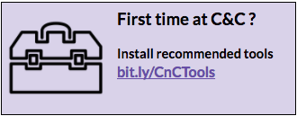

# Coding & Cocktails Session 5:
## Intro to Front-End Architecture {#intro-to-front-end-architecture}

### Overview {#overview}

Basics of how to structure your websites and applications for more efficient and sustainable management.
 
   
