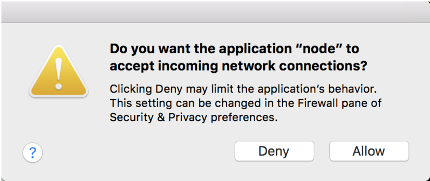

### Part 5:  Preview your app {#part-5-preview-your-app}

Now, let’s run a Node.js web server to preview our app.

1.  In CLI, type: `npm run serve`

  

  When you run the `npm run serve` command, you may receive a prompt that looks like this:

  

  Select **Allow**.

  

2.  Go to [localhost:3000](http://localhost:3000/) in your browser.



- When you run the ``npm run serve`` command, you are telling Node to start a server that uses the http protocol to listen on port 3000.
- Ports are communication endpoints that exist between operating systems.
- Port 3000 is a local port, so a web server listening on that port will only be available on your local system. You'd typically use ports 80 or 443 if you wanted to publish a site to the Internet.
- Once you're ready to stop your http server, you can press keys **Ctrl+C** together, to cancel out of your command.


