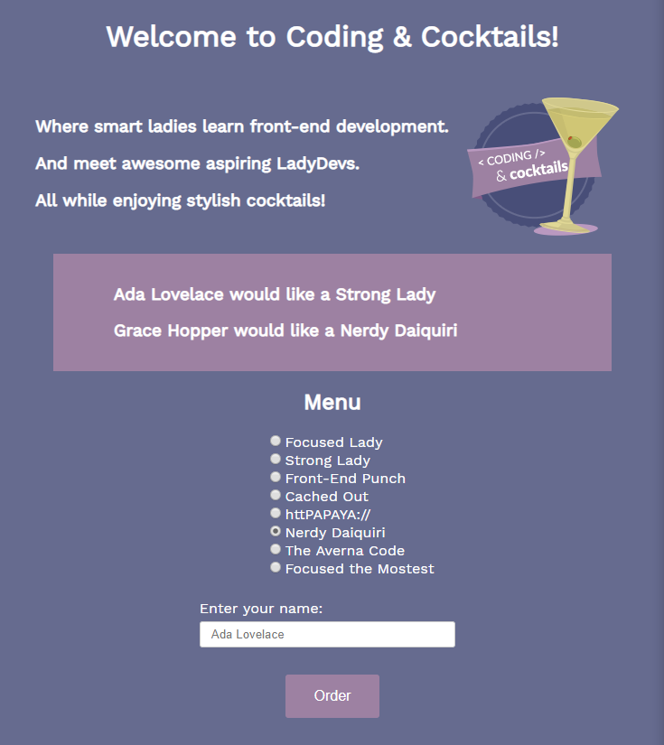

# A Deeper Dive into JavaScript {#top}
We will start by practicing JavaScript fundamentals and diving deeper into DOM ([Document Object Model](https://developer.mozilla.org/en-US/docs/Web/API/Document_Object_Model/Introduction)) manipulation before we explore new concepts such as events and objects. JavaScript is one of many programming languages used for application development.

Tonight we will create an web application with interactive elements and dynamic content that looks like this: 

<!-- trick markdown to give me a little space between these two sections of text -->
## 

Before starting the worksheet, please take a moment to review [Setup instructions](/setup) to ensure you have all the tools and workspace setup you need for tonight's work.


<!-- trick markdown to give me a little space between these two sections of text -->
## 
This section will help guide you through the following steps:



## Prepare your workspace and serve your web page {#prepare} <a href="#top" title="Take me to the top of page"><i class="fa fa-chevron-circle-up" aria-hidden="true"></i></a>


## Create a function and retrieve element value by id {#text} <a href="#top" title="Take me to the top of page"><i class="fa fa-chevron-circle-up" aria-hidden="true"></i></a>
We'll write a function that updates the DOM dynamically with text. Remember a function is a bit of code that takes input, process the input and returns some output - sort of like a coffee machine!


## Retrieve an element by query selector {#radio} <a href="#top" title="Take me to the top of page"><i class="fa fa-chevron-circle-up" aria-hidden="true"></i></a>
We retrieved an element from the DOM via its id. Now we'll retrieve the selected radio button value by its CSS selector string.


<!-- trick markdown to give me a little space between these two sections of text -->
## 
**High Five!!**

Nice job!!! Time to grab a drink and celebrate!

<!-- trick markdown to give me a little space between these two sections of text -->
## 

## Checkpoint <a href="#top" title="Take me to the top of page"><i class="fa fa-chevron-circle-up" aria-hidden="true"></i></a>
Compare your _my-script.js_ against the answer key for your work so far. It might look a little different depending on spacing.  


<!-- trick markdown to give me a little space between these two sections of text -->
## 
## References and helpful links <a href="#top" title="Take me to the top of page"><i class="fa fa-chevron-circle-up" aria-hidden="true"></i></a>
[What is a programming language video](https://vimeo.com/250067069)

[MDN Reference: Document API's getElementById](https://developer.mozilla.org/en-US/docs/Web/API/Document/getElementById)

[MDN Reference: Locating DOM elements using selectors](https://developer.mozilla.org/en-US/docs/Web/API/Document_object_model/Locating_DOM_elements_using_selectors)

[MDN Reference: Document API's querySelector](https://developer.mozilla.org/en-US/docs/Web/API/Document/querySelector)

[MDN Reference: Function](https://developer.mozilla.org/en-US/docs/Glossary/Function)

