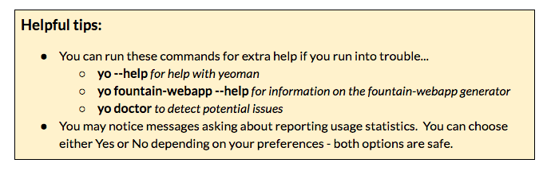

### Part 3:  Install a generator {#part-3-install-a-generator}

There are over [3500+ generators](https://www.google.com/url?q=http://yeoman.io/generators/&sa=D&ust=1479671279385000&usg=AFQjCNEHpZsxM9jpFjWgCztSDbpNFpL8ww) available for Yeoman. A generator is a plugin that can be used to scaffold your app. A plugin is software that complements and integrates into an existing application.

1.  Let’s install the [Fountain Webapp](https://www.google.com/url?q=http://fountainjs.io/&sa=D&ust=1479671279386000&usg=AFQjCNHPorpdiJpHdmqlpsGDD_OOVunYHA) generator using CLI, by typing: ``npm install -g generator-fountain-webapp``
2.  Type ``yo`` to see your generators.

