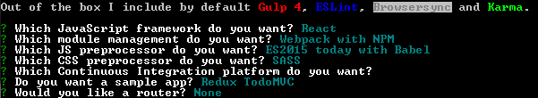

### Part 4: Configure your generator {#part-4-configure-your-generator}

There are custom options available for the fountain-webapp generator. Let's make our configuration selections now.

1.  Select the **Fountain Webapp** option after running the ``yo`` command.



- Make sure you are in the folder you want to scaffold into before continuing.
- You can use ``pwd`` to see your current directory and **cd** if you need to change directories.



1.  Make the selections in the following screenshot. 

1.  Once Yeoman is done, explore your directory structure using Atom or explorer to see what scaffolding has been created. You’ll notice that the structure is different than what we saw with the manual practice on this worksheet. This is a good example of two different application types that use two different types of directory structures.
