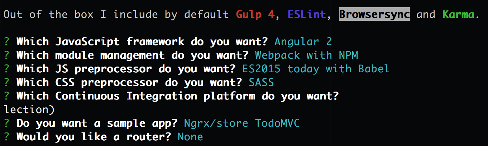

### Part 4: Configure your generator {#part-4-configure-your-generator}

There are custom options available for the fountain-webapp generator. Let's make our configuration selections now.

1.  Select the **Fountain Webapp** option after running the `yo` command.



- Make sure you are in the folder you want to scaffold into before continuing. You created this in [Part 1](part_1_create_a_project_folder.md).
- You can use `pwd` to see your current directory and `cd` if you need to change directories.



1.  Make the selections in the following screenshot. 

1.  Once Yeoman is done, explore your directory structure using Atom or explorer to see what scaffolding has been created. You’ll notice that the structure is different than what we saw with the manual practice on this worksheet. This is a good example of two different application types that use two different types of directory structures.



Yeoman will be installing a bunch of files and can take a few minutes. It can even seem like nothing is going on in your CLI at times [but trust me, it is]. This is a great time to get another drink & socialize with your neighbors!

If you happen to close or cancel the CLI window during this time, no fear! Make sure _mytodo_ is the current working directory [hint: `pwd`] in your CLI, and type: `npm install` and the process will kick-off and finish installing.

Note: Cloud9 users, this process can easily take 15 minutes.


