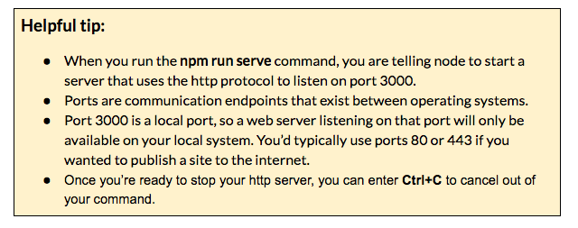

### Part 5:  Preview your app {#part-5-preview-your-app}

Now, let’s run a Node.js web server to preview our app.

1.  In CLI, type: `npm run serve`
2.  Go to [localhost:3000](http://localhost:3000/) in your browser.

