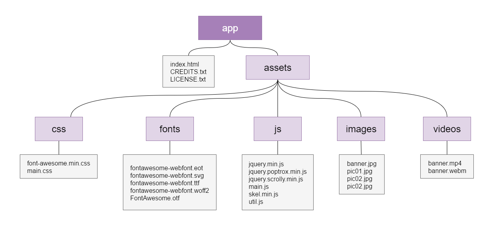
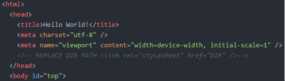
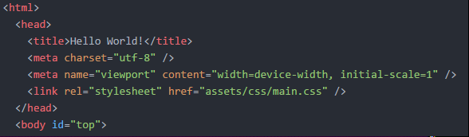
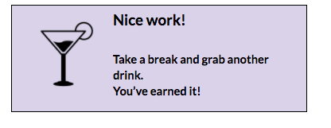

### Part I: Manual Practice {#part-i-manual-practice}

First, let’s take a look at how to manually organize your project files.

1.  Download the assets at [http://bit.ly/2bVHBAi](http://bit.ly/2bVHBAi) and unzip the file.
2.  Create a root directory named _app_ in your _CodingAndCocktails/Architecture_ folder.

  

  The _CREDITS_, _LICENSE_ and _index.html_ files will live here for the website we'll be previewing. These contain information on copyright information and redits for any licensed objects. The template downloaded is licensed by [templated.co](http://templated.co), a great resource for website templates.

  

1.  Let’s get organizing! Create the necessary folders and add your project files like in the following diagram.

       

  

  The directory name **js** is interchangeable with the directory name **scripts**.

  

1.  Now open the _index.html_ file in Google Chrome to preview your site. Oh no! Looks like the site is broken. We’re missing the styling and some images specifically. Our HTML page doesn’t know how we’ve organized our project so we’ll need to tell it where to find the files it needs.

       

1.  Open index.html in SublimeText and search for all the lines starting with ``< -- REPLACE DIR PATH``  to remove that block of code. Also remove the closing comment mark, ``-->`` at the end of the same lines.
2.  In those same lines, you’ll see  ``DIR`` where the path of the files referenced should be. Replace ``DIR`` with the applicable file path. In the example below, that would be ``assets/css/main.css``.

    1. Before: 
       

  2.  After: 
      

1.  Go through the rest of the _index.html_ file and make the same necessary changes for the other lines beginning with  ``<-- REPLACE DIR PATH`` . Once done, save _index.html_ and reload it in your browser.

Your site should now be working! We’ve organized all of your files AND _index.html_ knows where they are located.

