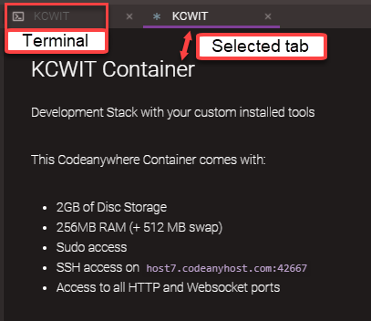

1. Tonight we will use [Codeanywhere](https://codeanywhere.com). Sign up for a Codeanywhere account and log in.

1. In the **Connection Wizard** dialog, enter the name "KCWIT" and select "Blank Development Stack Ubuntu 14.04" as shown in the picture below. Press **CREATE**.

   

1. You will see two tabs named "KCWIT". Leave both tabs open. The **KCWIT Container** tab that displays shows the address for the container. We will use this later in the worksheet. Select the tab with the <span class="octicon octicon-terminal"></span>. This is your terminal.

   

1. In the terminal type `` and press `Enter`.

1. We need to install the toolsets that we will use tonight. Copy all the code below and paste into the terminal using `Shift + Insert`. The terminal will start executing. Press `Enter` so the commands finish executing.
   ```bash
sudo apt-get update
curl -o- https://raw.githubusercontent.com/creationix/nvm/v0.33.8/install.sh | bash
export NVM_DIR="$HOME/.nvm"
[ -s "$NVM_DIR/nvm.sh" ] && \. "$NVM_DIR/nvm.sh"
nvm install node
   ```

   
Feel free to grab a mentor to help guide you through this step.
   

1. Create a "CodingAndCocktails" folder by typing `mkdir CodingAndCocktails` and press `Enter`. 

1. Navigate into the directory by typing `cd CodingAndCocktails` and press `Enter`.

1. Create an "Architecture" folder by typing `mkdir Architecture` and press `Enter`. Navigate into the "Architecture" directory by typing `cd Architecture` and press `Enter`.

1. Let's clone a repo from Github so the files we need for Manual Practice is ready.

  1. Visit the [Front End Architecture repo in Github](https://github.com/KansasCityWomeninTechnology/front-end-architecture-ws).

  1. Click the green **Clone or download** button & then click the clipboard icon to copy the path.

1. In the Codeanywhere terminal, type `git clone` and paste the link you copied using `Shift` + `Insert`. Press `Enter`. It will create a folder called "front-end-architecture-ws". You will use the contents inside this folder instead of downloading the files in Manual Practice.

1. Right click on "KCWIT" container and select **Refresh**. This will show all your new folders and files in the left pane. You can now drag and drop files between folders in this pane. You will manually have to refresh the view every time you create or make changes to folders and files in the terminal.

   
Your container may automatically turn off if you leave it idle for too long. Right click on **KCWIT** and 
   
