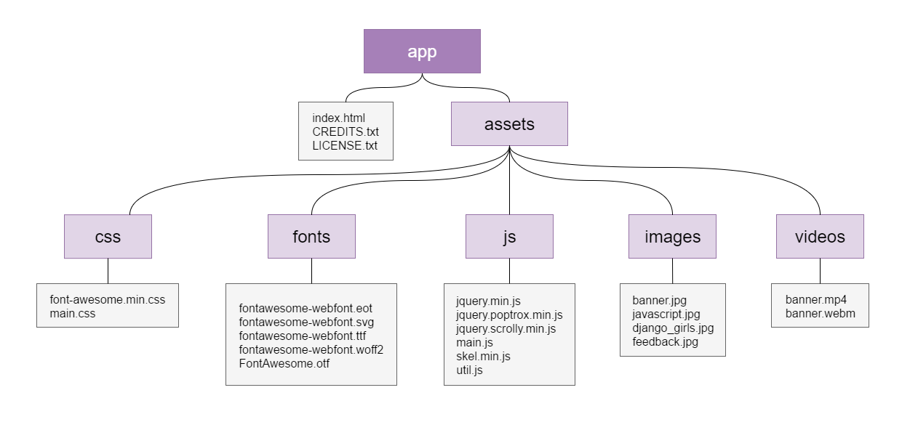
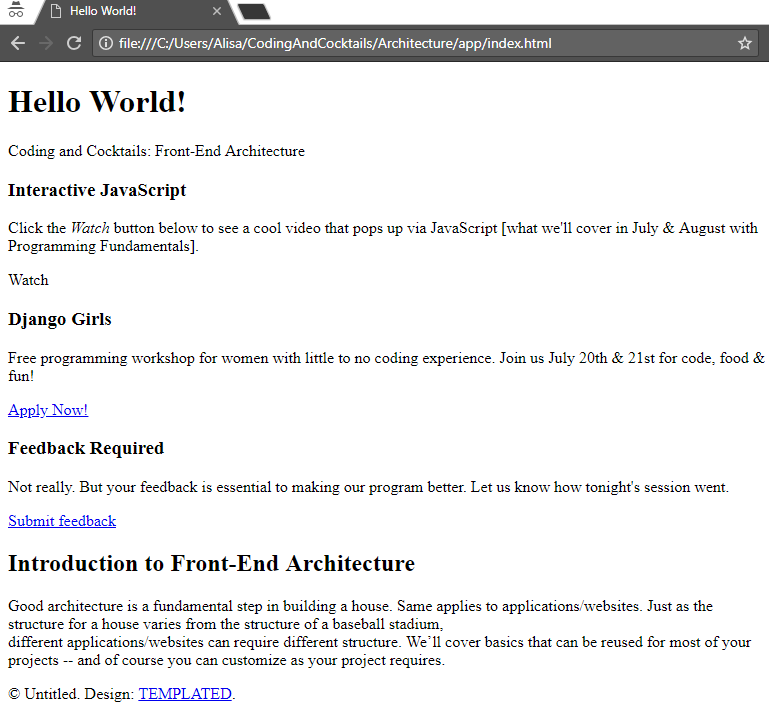

3.  Let’s get organizing! Create the necessary folders and add your project files like in the following diagram.

       

  

  The directory name **js** is interchangeable with the directory name **scripts**.

  

4.  Now open the _index.html_ file in Google Chrome to preview your site. Oh no! Looks like the site is broken. We’re missing the styling and some images specifically. Our HTML page doesn’t know how we’ve organized our project so we’ll need to tell it where to find the files it needs.

       

  <!--sec data-title="Cloud9: Preview" data-id="cloud9Preview" data-show=true data-collapse=true ces-->

  - To preview your file in Cloud9, right click on the _index.html_ file & select **Preview**.

  - Instead of Atom, you'll be using the built-in text editor in your workspace. Double-click on the _index.html_ file to open it in the editor.

  <!--endsec-->