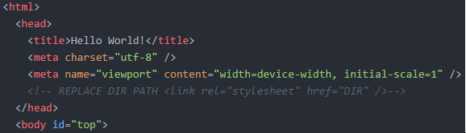
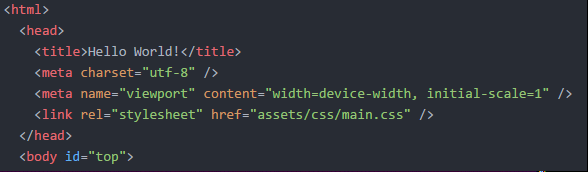
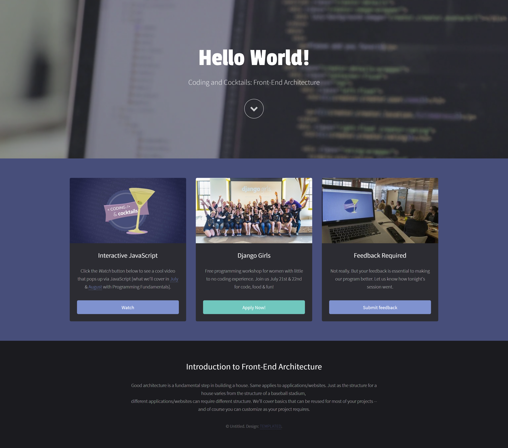

1.  Open _index.html_ in Atom and search for all the lines starting with `< -- REPLACE DIR PATH`  to remove that block of code. Also remove the closing comment mark, `-->` at the end of the same lines.

1.  In those same lines, you’ll see `DIR` where the path of the files referenced should be. Replace `DIR` with the applicable file path. In the example below, that would be `assets/css/main.css`.

  1. Before:

     

  1. After:

     

1.  Go through the rest of the _index.html_ file and make the same necessary changes for the other lines beginning with  `<-- REPLACE DIR PATH`. Once done, save _index.html_ and reload it in your browser.

  
Watch out for `data-video="DIR"`. Make sure to read all the `<!-- Banner -->` comment details for replacing `DIR` with the file path. When you set this correctly, there is _JavaScript_ that will load a video in the background of your site.
  

Your site should now be working! We’ve organized all your files AND _index.html_ knows where they are located.

