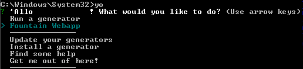
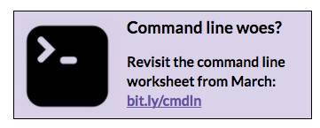

1. Let’s install the [Fountain Webapp](http://fountainjs.io/) generator by typing `npm install -g generator-fountain-webapp`
```bash
sudo npm install --no-bin-links generator-fountain-webapp
``` 
for Chromebooks (in a different folder)

2.  Type ``yo`` to see your generators.  

  



- You can run these commands for extra help, if you run into trouble...
  - ``yo --help`` _for help with Yeoman_
  - ``yo fountain-webapp --help`` _for information on the fountain-webapp generator_
  - ``yo doctor`` _to detect potential issues_
- You may notice messages asking about reporting usage statistics. You can choose **Yes** or **No** depending on your preferences - both options are safe.



### Part 1: Create a project folder {#part-1-create-a-project-folder}

When you’re starting from scratch, an empty project is simply an empty folder. You could do that visually (using your file explorer) but let’s do it in CLI.

[](http://bit.ly/cmdln)

1.  Navigate to your _CodingAndCocktails/Architecture_ folder: ``cd <your home directory>/CodingAndCocktails/Architecture``

  

  - Your home directory is:
    - Mac: _/users/<yourUsername>_
    - Windows: _C:/Users/<youUsername>_
  - Command to change folders: ``cd <folderToGoTo>``
  - You can also use **~** as a shortcut in CLI for your home directory: ``cd ~``
  - Command to make a folder: ``mkdir <newFolder>``
  - Most command line applications are not case sensitive, but a few are!

  

2.  Make a new folder called mytodo: ``mkdir mytodo``
3.  Move into that new folder: ``cd mytodo``

  

  If you start typing the name of a folder or file, hit **tab** and it will autocomplete.

  