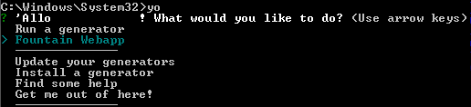

1. Install the [Fountain Webapp](http://fountainjs.io/) generator by typing `npm install -g generator-fountain-webapp` <i class="fa fa-share fa-rotate-180"></i>.

1. Type `yo` <i class="fa fa-share fa-rotate-180"></i> to see your generators.

   

1. Press the down arrow until you highlight **Get me out of here!** and press `Enter` to exit out of Yeoman.

   
You can run these commands for extra help, if you run into trouble...
  - `yo --help` _for help with Yeoman_
  - `yo fountain-webapp --help` _for information on the fountain-webapp generator_
  - `yo doctor` _to detect potential issues_

You may notice messages asking about reporting usage statistics. You can choose **Yes** or **No** depending on your preferences - both options are safe.
   

1. Type the command for your OS and press `Enter` to navigate to your "CodingAndCocktails/Architecture" folder.

    
cd ~/CodingAndCocktails/Architecture
    
cd %USERPROFILE%/CodingAndCocktails/Architecture
    
cd ~/workspace/CodingAndCocktails/Architecture
   

1. Type `mkdir mytodo` <i class="fa fa-share fa-rotate-180"></i> to make a new folder called "mytodo". 

1. Type `cd mytodo` to navigate into your new folder.

   
If you start typing the name of a folder or file, press `Tab` and it will autocomplete.
  