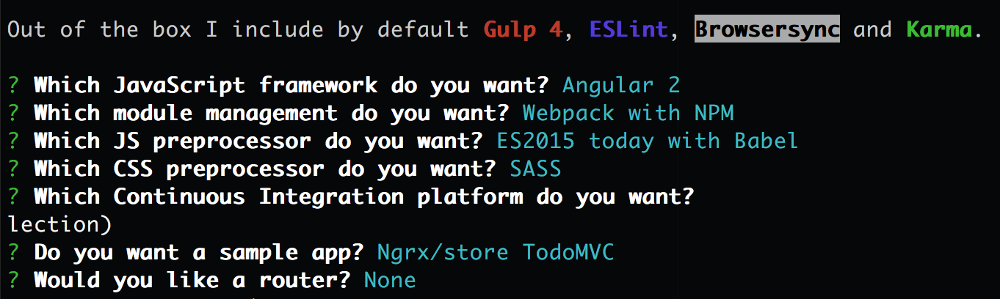

1. Type `yo` <i class="fa fa-share fa-rotate-180"></i>. Select the **Fountain Webapp** option.

1. Make the selections in the following screenshot. On the Continuous Integration platform option, press `Enter` to skip it.
   
   

   
The fountain webapp generator may display a message asking to report usage statistics. Choose whichever option you wish.
   

   
Yeoman installs a bunch of files and can take a few minutes. It might seem like nothing is going on in your terminal at times. This is a great time to get another drink & socialize with your neighbors!

If you close the terminal window or cancel the install process during this time, don't panic! 
You can pick back up by following these steps:
 - Navigate to your "mytodo" directory. Type `pwd` <i class="fa fa-share fa-rotate-180"></i> in your terminal to double check you are in the "mytodo" directory.
 - Type `npm install` <i class="fa fa-share fa-rotate-180"></i> to finish installing.
  

1.  Once Yeoman completes, explore your directory structure using Atom or the file explorer to see the scaffolding for your web application. You’ll notice that the structure is different than what we saw with the manual practice on this worksheet. This is a good example of two different application types that use different directory structures.

  
Open Atom by typing `atom .` <i class="fa fa-share fa-rotate-180"></i>.

Open a file explorer by using the command for your OS:
   - Mac- `open .` <i class="fa fa-share fa-rotate-180"></i>

   - Windows- `start .` <i class="fa fa-share fa-rotate-180"></i>

   - Chromebook users- You will use the built in file viewer
  

  