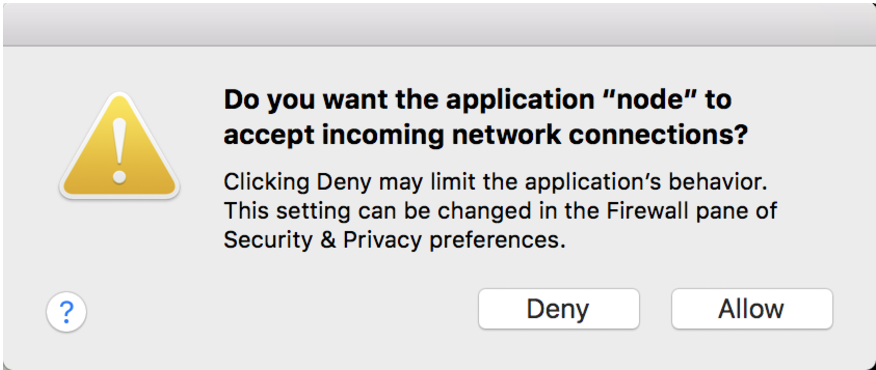
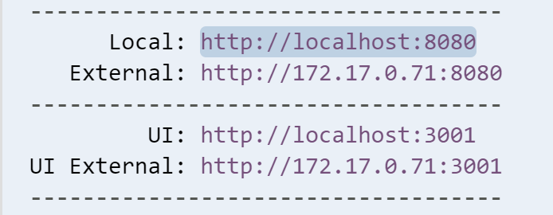

### Part 5:  Preview your app {#part-5-preview-your-app}

Now, let’s run a Node.js web server to preview our app.



Cloud9 users, check the bottom for some special instructions.



1.  In CLI, type: `npm run serve`

  

  When you run the `npm run serve` command, you may receive a prompt similar to this:

  

  Select **Allow**.

  

2.  Go to [localhost:3000](http://localhost:3000/) in your browser.



- When you run the `npm run serve` command, you are telling Node to start a server that uses the http protocol to listen on port 3000.
- Ports are communication endpoints that exist between operating systems.
- Port 3000 is a local port, so a web server listening on that port will only be available on your local system. You'd typically use ports 80 or 443 if you wanted to publish a site to the Internet.
- Once you're ready to stop your http server, you can press keys **Ctrl+C** together, to cancel out of your command.



<!--sec data-title="Chromebooks Only: Cloud9 npm run serve" data-id="section0" data-show=true data-collapse=true ces-->

Cloud9 only listens for a few ports: `8080`, `8081` & `8082`. By default, the fountain webapp generator settings use `3000`, so we need to update those settings.

1. In the _mytodo_ folder, there is a _conf_ folder [short for **config**], click on the arrow to expand the _conf_ folder.

2. Open the _browsersync.conf.js_ file in the editor. We need to add `port: '8080'` to this file. Below is how we want the file to look. For simplicity, you can replace the whole file's contents by copying the below code with the **Copy** button and pasting it over the contents of the _browsersync.conf.js_ file.

  ```
  const conf = require('./gulp.conf');

  module.exports = function () {
    return {
      server: {
        baseDir: [
          conf.paths.tmp,
          conf.paths.src
        ]
      },
      open: false,
      port: '8080'
    };
  };

  ```

3. After saving the file, you're ready to type `npm run serve` in the terminal. In the output, you'll see something like this:  

  

  Click on `http://localhost:8080` & select **Open** from the menu. Your working app should open in a new browser window! Cheers!

<!--endsec-->
