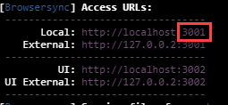
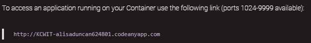

1. In the terminal, type `npm run serve` <i class="fa fa-share fa-rotate-180"></i>.

  
When you run the `npm run serve` command, you may receive a prompt similar to this:

Select **Allow**.
  

1. In Chrome, navigate to [localhost:3000](http://localhost:3000/).

   
- When you run the `npm run serve` command, you are telling Node to start a server that uses the http protocol to listen on port 3000.
- Ports are communication endpoints that exist between operating systems.
- Port 3000 is a local port, so a web server listening on that port will only be available on your local system. You'd typically use ports 80 or 443 if you wanted to publish a site to the Internet.
- This a good opportunity to practice creating a public tunnel so you can show off your app on #codingandcocktails channel in Slack! Follow the instructions from [Command Line Basics Bonus: Create a public tunnel](https://codingandcocktailskc.gitbooks.io/session-2-command-line-basics/content/homework/web-server.html#create-a-public-tunnel). 
- Once you're ready to stop your http server, press keys **Ctrl+C** together to cancel out of your command.
 

<!--sec data-title="Chromebook instructions to serve app" data-id="section2" data-show=true data-collapse=true ces-->

Codeanywhere doesn't support viewing our app using localhost. We have to navigate to the container URL.

1. Take a note of the port by the server. The contrast ratio might be a little hard to read. In the picture below, the app is served to port 3001.

   

1. In the info page for "KCWIT" container, find the URL of the container as shown in the picture below. This is how we can access the container in Chrome.

   

1. In Chrome, navigate to the URL of the container. Add a `:` and the port number. In this example, the URL is `http://kcwit-alisaduncan624801.codeanyapp.com:3001`.

1. Enjoy your new web application!

<!--endsec-->
