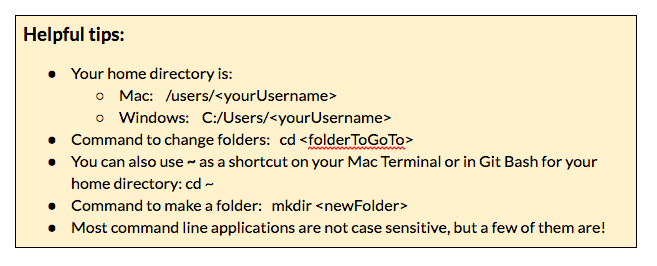
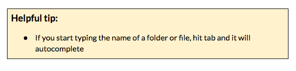

### Part 1: Create a project folder {#part-1-create-a-project-folder}

When you’re starting from scratch, an empty project is simply an empty folder. You could do that visually (using your file explorer) but let’s do it in Git Bash (windows) or iTerm2 (macs).

1.  Navigate to your CodingAndCocktails folder: ``cd <your home directory>/CodingAndCocktails``

1.  Make a new folder called mytodo: ``mkdir mytodo``
2.  Move into that new folder: ``cd mytodo``

