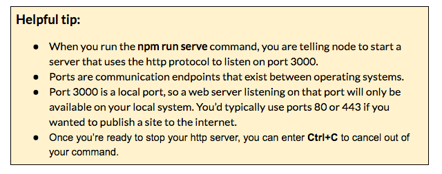

### Part 5:  Preview your app {#part-5-preview-your-app}

Now, let’s run a NodeJS web server to preview our app.

1.  In Git Bash (windows) or iTerm2 (macs), type: `npm run serve`
2.  Go to [localhost:3000](https://www.google.com/url?q=http://localhost:3000/&sa=D&ust=1479671279397000&usg=AFQjCNH__ONZow9H0Yk7DivGyXe8ymGnCQ) in your browser.

